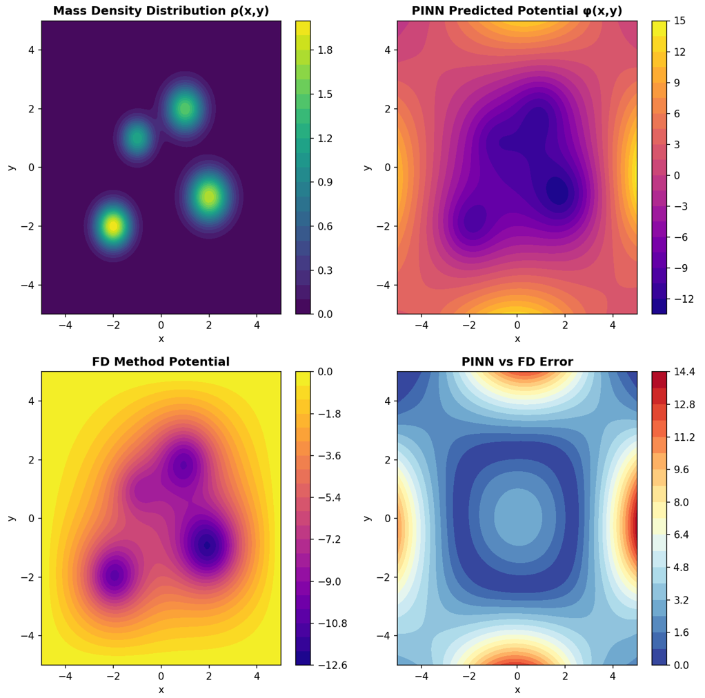
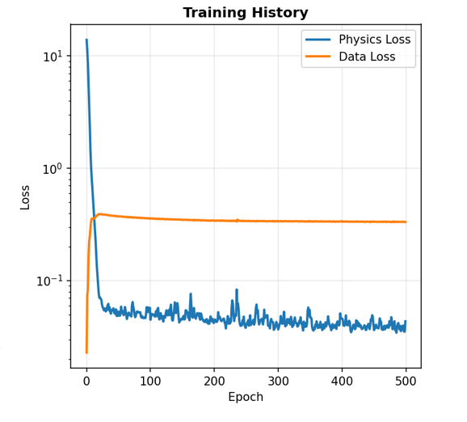

# Physics-Informed Neural Network for Modeling the Gravitational Potential of an Irregular Body
 
 
 
 
 
 


## Overview


This project implements a Physics-Informed Neural Network (PINN) to model the gravitational potential field $ϕ(x, y)$ generated by an irregular mass distribution (e.g., asteroid).

Unlike traditional numerical solvers that rely on discretized grids or meshes, the **PINN** learns the potential function continuously by *embedding Poisson’s equation directly into its loss function*, blending physics laws and neural networks for accurate and generalizable predictions.


##  Why a New Gravity Model?
Newtonian gravity, while elegant, breaks down at certain levels of precision — for instance, in Mercury’s orbital precession — and conflicts with relativity’s light-speed limit.

Although this project remains within the realm of Newtonian mechanics, it highlights how AI can model gravitational systems more flexibly and serve as a bridge toward relativistic PINNs in future work.

##  Mathematical Formulation
We model the potential ϕ(x, y) using Poisson’s equation

**$$∇2ϕ(x,y)=4πGρ(x,y)$$**


Where:

- **$𝜙(𝑥,𝑦)$** = gravitational potential
- **$𝜌(𝑥,𝑦)$** = mass density
- **$𝐺$** = gravitational constant

The PINN enforces this physical law through its loss function:

  **$$L=Lphysics​+Ldata​$$**
  
with:

  **$$Lphysics​=∣∣∇2ϕ−4πGρ∣∣²$$** , **$$Ldata​=∣∣ϕpred​−ϕtrue​∣∣² $$**


## Tech Stack:

- Python 3.10+

- PyTorch – Deep learning framework

- DeepXDE – Physics-Informed Neural Networks toolkit

- NumPy – Numerical computations

- Matplotlib – Visualization

  
## Evaluation Metrics (PINN vs FD)
<div align="center">


| Metric              |   Value  |
| :------------------ | :------: |
| **RMSE**            | 4.401050 |
| **MAE**             | 3.534299 |
| **MAPE**            |  1.13e11 |
| **R²**              |  -1.1096 |
| **Mean Prediction** |  -0.1768 |
| **Std**             |  5.7719  |
| **Min**             | -12.9625 |
| **Max**             |  14.1818 |

</div>

## How to run
```
# Clone this repository
git clone https://github.com/<your-username>/Physics-Informed-Neural-Network-Gravitational-Potential.git
cd Physics-Informed-Neural-Network-Gravitational-Potential

# Launch the notebook
jupyter notebook PINNs_notebook.ipynb
```

## Results

- The PINN successfully learned the gravitational potential of an irregular body, producing a smooth and physically consistent potential field.

- Residuals of Poisson’s equation remained low across the domain, showing strong physical adherence.

- The model generalizes to new density configurations unseen during training.

<div style="text-align: center;">
  <div style="display: inline-block;">
    
    
  </div>
</div>


